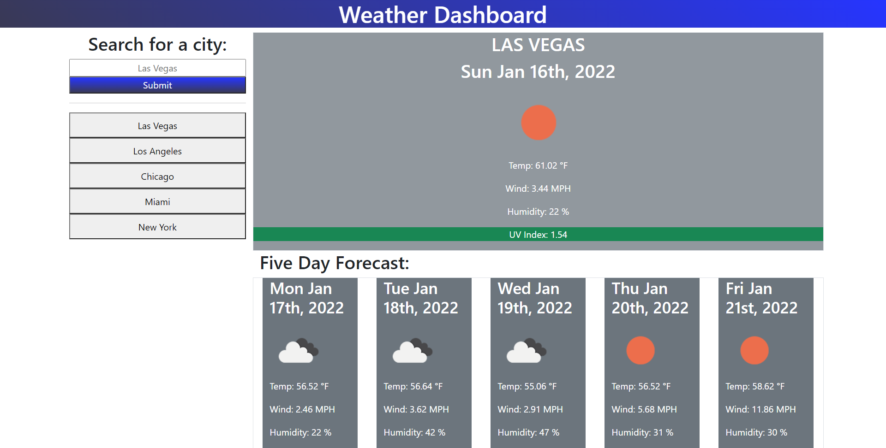

# weather-dashboard

## Description
The purpose of this application is to create a weather dashboard to display current and future forecast.

## Table of Contents

* [Installation](#installation)
* [Usage](#usage)
* [Credits](#credits)
* [License](#license)

## Installation

The project is viewable at the project's github pages.

URL of deployed application: https://armcuellar.github.io/weather-dashboard/

## Usage
When a city is entered the dashboard, it will generate the current and future forcast of that city. A recent search history is also included to quickly revist searched cities' forecast.

## Credits

[Armando Cuellar](https://github.com/armcuellar) 

With the help of:
* [bootstrap](https://getbootstrap.com/)
* [moment](https://momentjs.com/)
* [OpenWeather One Call API](https://openweathermap.org/api/one-call-api)

## License

Licencsed under [MIT License](LICENSE)